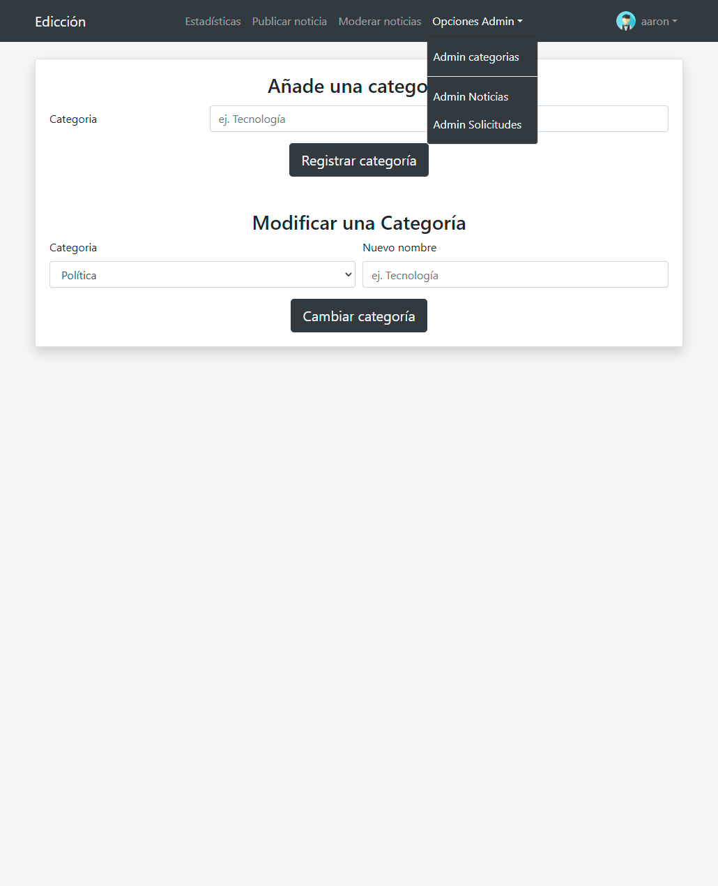

# Zeitung

Final degree project, using PHP, JavaScript, HTML, CSS, and MySQL, CodeIgniter, JQuery, Chart.js, and Bootstrap.

## Release Information

## Server Requirements

PHP version 5.6 or newer is recommended.

## Starting the Project

```bash
docker-compose up
```

Then navigate to http://localhost:8080

## Project screenshots:

### Newspaper:

Index

<div align="center" >
  
</div>

Search

<div align="center" >
  
</div>

News

<div align="center" >
  
</div>

Editor profile

<div align="center" >
  
</div>

Contact form

<div align="center" >
  
</div>

### Editor side

Login

<div align="center" >
  
</div>

Editor sign up petition, if an admin allows the petition the new editor will receive an email to set up his account

<div align="center" >
  
</div>

If an admin accepts the editor petition, he will be sent an email with a register link

<div align="center" >
  
</div>

Editor Statistics

<div align="center" >
  
</div>

Editor news publishing text editor

<div align="center" >
  
</div>

Editor news moderation

<div align="center" >
  
</div>

Editor news comments moderation

<div align="center" >
  
</div>

Editor profile settings

<div align="center" >
  
</div>

### Admin section

This section can only be accessed by editors granted admin privileges, it allows them to moderate all other editors and add new "Categories"

Admin category management

<div align="center" >
  
</div>

Admin news management

<div align="center" >
  
</div>

Admin editor register management

<div align="center" >
  
</div>
